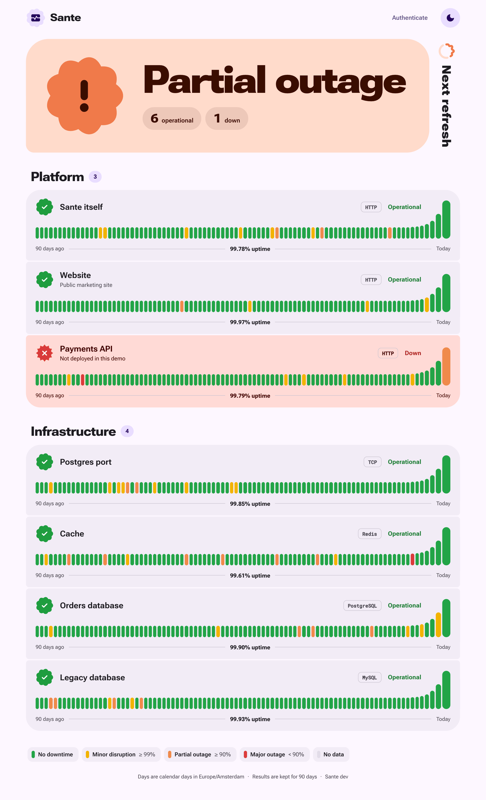

# Sante

A self-hosted uptime monitor for HTTP endpoints, TCP ports, Redis, MySQL and
PostgreSQL. You configure it with one YAML file. It keeps 90 days of results
in SQLite, shows them on a status page, and sends down alerts to Slack or
Mattermost.



## Quick start

### Docker Compose demo

```sh
docker compose up --build
```

Open <http://localhost:8080> and use the token `sante`. The demo runs Redis,
PostgreSQL and MySQL next to Sante and fills in 90 days of fake history. One
monitor, Payments API, is always down so there's an outage to look at.

If port 8080 is taken, run `SANTE_PORT=9090 docker compose up`.

### Docker

```sh
docker build -t sante .
docker run -d --name sante -p 8080:8080 \
  -v $PWD/config.yaml:/etc/sante/config.yaml:ro \
  -v sante-data:/data \
  -e TZ=Europe/Amsterdam -e DB_PASSWORD=... \
  sante
```

The database goes in the `/data` volume. If you don't mount a config, the
image uses `config.example.yaml`, which won't start until `SANTE_TOKEN` is set.

### From source

Requires Go 1.27.

```sh
cp config.example.yaml config.yaml
go run . -config config.yaml
```

## Commands

```
sante [serve] [-seed]   run the monitor and web UI (default)
sante seed [-reset]     fill the database with 90 days of fake history
sante validate          check the config and list the monitors
sante test-webhooks     send a test alert to every webhook
sante healthcheck       exit 0 if the local instance is healthy
sante version           print the version
```

Every command takes `-config path`. The default is `$SANTE_CONFIG`, then
`config.yaml`.

## Configuration

Every setting is described in [docs/configuration.md](docs/configuration.md).
[`config.example.yaml`](config.example.yaml) is a commented example.

## Demo data

To get a full status page without waiting 90 days:

```sh
sante serve -seed    # seed on startup if the database is empty
sante seed           # seed and exit; refuses if there's already data
sante seed -reset    # delete the configured monitors' history, then seed
```

You get the same history for a monitor every time you seed it: normal
latencies, a few outages, and the odd failed check. Real checks take over
from the moment Sante starts.
